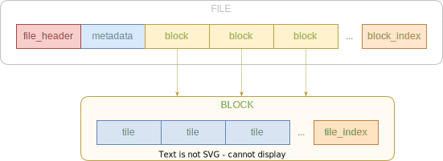
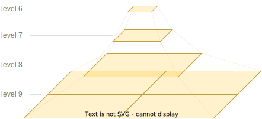
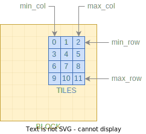

# Versatiles Container Format Specification v2.0

## 1. Overview

- All numbers shall be stored in big endian byte order.
- Tiles are organised in XYZ scheme (not in TMS scheme). So tiles with x=0, y=0 are in the top left (north west) corner.

## 2. Container Format

The file is composed of four parts:
1. starting with a [**`file_header`**](#21-chunk-file_header)
2. followed by compressed [**`metadata`**](#22-chunk-metadata)
3. followed by several [**`block`s**](#23-multiple-chunks-block), where each block consists of:
	- concatenated [**`tile_blobs`**](#231-multiple-tile_blobs)
	- followed by [**`tile_index`**](#232-tile_index) as an index of these tiles
4. followed by [**`block_index`**](#24-chunk-block_index) as an index of all blocks

|           File Format           |
|:-------------------------------:|
|  |

### 2.1. Chunk: `file_header`

- has a length of 66 bytes
- all offsets are relative to start of the file

| offset | length | type   | description             |
|--------|--------|--------|-------------------------|
| 0      | 14     | string | `"versatiles_v02"`      |
| 14     | 1      | u8     | `tile_format`           |
| 15     | 1      | u8     | `precompression`        |
| 16     | 1      | u8     | min zoom level          |
| 17     | 1      | u8     | max zoom level          |
| 18     | 4      | i32    | bbox min x (10⁷ × lon)  |
| 22     | 4      | i32    | bbox min y (10⁷ × lat)  |
| 26     | 4      | i32    | bbox max x (10⁷ × lon)  |
| 30     | 4      | i32    | bbox max y (10⁷ × lat)  |
| 34     | 8      | u64    | offset of `metadata`    |
| 42     | 8      | u64    | length of `metadata`    |
| 50     | 8      | u64    | offset of `block_index` |
| 58     | 8      | u64    | length of `block_index` |

#### 2.1.1. Value `tile_format`

| value  | type     | mime                       |
|--------|----------|----------------------------|
| `0x00` | bin      | *application/octet-stream* |
| `0x10` | png      | *image/png*                |
| `0x11` | jpg      | *image/jpeg*               |
| `0x12` | webp     | *image/webp*               |
| `0x13` | avif     | *image/avif*               |
| `0x14` | svg      | *image/svg+xml*            |
| `0x20` | pbf      | *application/x-protobuf*   |
| `0x21` | geojson  | *application/geo+json*     |
| `0x22` | topojson | *application/topo+json*    |
| `0x23` | json     | *application/json*         |

#### 2.1.2. Value: `precompression`

Metadata and all tiles are precompressed with:
- `0`: uncompressed
- `1`: gzip compressed
- `2`: brotli compressed

### 2.2. Chunk: `metadata`

- content of `tiles.json`
- encoded in UTF-8
- compressed with `$precompression`
- If no metadata is specified, offset and length must be `0`.

### 2.4. Multiple chunks: `block`

- Each `block` is like a "super tile" and contains data of up to 256×256 (= 65536) `tile`s.
- Levels 0-8 can be stored with one `block` each. Level 9 can contain up to 512×512 `tile`s so up to 4 `block`s are necessary.
- Number of blocks: `max(1, pow(2, (level-7))`

|        `block`s per level         |
|:---------------------------------:|
|  |

- Each `block` contains concatenated `tile` blobs and ends with a `tile_index`.
- Neither `tile`s in a `block` nor `block`s in a `file` have to be sorted in any kind of order, as long as their indexes are correct.

#### 2.3.1. Multiple `tile_blob`

- each tile is a PNG/PBF/... file as data blob
- compressed with `$precompression`

#### 2.3.2. `tile_index`

- Brotli compressed data structure
- Tiles are read horizontally then vertically
- `index = (row - row_min) * (col_max - col_min + 1) + (col - col_min)`
- (`col_min`, `row_min`, `col_max`, `row_max` are specified in `block_index`)
- identical `tile_blob`s can be stored once and referenced multiple times to save storage space
- if a tile does not exist, the length of `tile_blob` is `0`
- offsets of `tile_blob`s are relative to the beginning of the `block`. So the offset of the first `tile_blob` should always be `0`.

| offset | length | type | description                      |
|--------|--------|------|----------------------------------|
| 12*i   | 8      | u64  | offset of `tile_blob` in `block` |
| 12*i+8 | 4      | u32  | length of `tile_blob`            |

|      index of `tile_blob`s      |
|:-------------------------------:|
|  |

### 2.4. Chunk: `block_index`

- Brotli compressed data structure
- Empty `block`s are not stored
- For each block, `block_index` contains a 33 bytes long record:

| offset    | length | type | description               |
|-----------|--------|------|---------------------------|
| 0 + 33*i  | 1      | u8   | `level`                   |
| 1 + 33*i  | 4      | u32  | `column`/256              |
| 5 + 33*i  | 4      | u32  | `row`/256                 |
| 9 + 33*i  | 1      | u8   | `col_min` (0..255)        |
| 10 + 33*i | 1      | u8   | `row_min` (0..255)        |
| 11 + 33*i | 1      | u8   | `col_max` (0..255)        |
| 12 + 33*i | 1      | u8   | `row_max` (0..255)        |
| 13 + 33*i | 8      | u64  | offset of `block` in file |
| 21 + 33*i | 8      | u64  | length of `tile_blobs`    |
| 29 + 33*i | 4      | u32  | length of `tile_index`    |

- Since a `block` only consists of `tile_blobs` appended by `tile_index`, the length of `block` must be the sum of the lengths of `tile_blobs` and `tile_index`.
- Note: To efficiently find the `block` that contains the `tile` you are looking for, use a data structure such as a "map", "dictionary" or "associative array" and fill it with the data from the `block_index`.

## 3. Glossary

