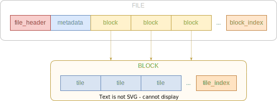
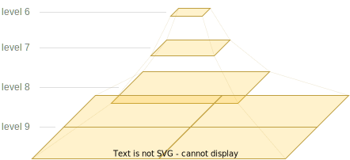

# Versatiles Container Format Specification v2.0

## 1. Introduction

This document defines the Versatiles Container Format v2.0, which describes the structure and encoding mechanisms for efficiently storing large numbers of map tiles.

## 2. General Guidelines

- **Byte order:** All numeric values are encoded in big-endian byte order.
- **Tile organization:** Tiles are organised according to the XYZ scheme, with the origin (x=0, y=0) located at the top-left (northwest) corner.

## 3. File structure

The Versatiles Container format consists of four main components:

1. **[File Header](#31-file-header):** Introduces the container file, details global properties, and indicates the locations of [Metadata](#32-metadata-chunk) and [Block Index](#34-block-index).
2. **[Metadata](#32-metadata-chunk):** Provides detailed information about the tileset, including attribution and layer definitions.
3. **[Blocks](#33-blocks):** Aggregates tiles into larger units (Blocks) for efficient storage and access, each containing [**Tile Blobs**](#331-tile-blobs) and [**Tile Index**](#332-tile-index).
4. **[Block Index](#34-block-index):** Acts as a parent directory for all blocks within the file.

|           File Format           |
|:-------------------------------:|
|  |

### 3.1. File Header

- **Length:** 66 bytes.
- **Location:** At the start of the file.
- **Purpose:** Outlines essential file properties and indicates subsequent section locations.
- all offsets are relative to start of the file

| Offset | Length |  Type  | Description                              |
|-------:|-------:|:------:|------------------------------------------|
|      0 |     14 | string | File identifier (`"versatiles_v02"`)     |
|     14 |      1 |   u8   | `tile_format` value                      |
|     15 |      1 |   u8   | `precompression` value                   |
|     16 |      1 |   u8   | minimum zoom level                       |
|     17 |      1 |   u8   | maximum zoom level                       |
|     18 |      4 |  i32   | bbox min x (10⁷ × lon)                   |
|     22 |      4 |  i32   | bbox min y (10⁷ × lat)                   |
|     26 |      4 |  i32   | bbox max x (10⁷ × lon)                   |
|     30 |      4 |  i32   | bbox max y (10⁷ × lat)                   |
|     34 |      8 |  u64   | offset of [Metadata](#32-metadata-chunk) |
|     42 |      8 |  u64   | length of [Metadata](#32-metadata-chunk) |
|     50 |      8 |  u64   | offset of [Block Index](#34-block-index) |
|     58 |      8 |  u64   | length of [Block Index](#34-block-index) |

#### 3.1.1. Value `tile_format`

| Value hex | Value dec |   Type   | Mime                       |
|----------:|----------:|:--------:|----------------------------|
|    `0x00` |       `0` |   bin    | *application/octet-stream* |
|    `0x10` |       `8` |   png    | *image/png*                |
|    `0x11` |       `9` |   jpg    | *image/jpeg*               |
|    `0x12` |      `10` |   webp   | *image/webp*               |
|    `0x13` |      `11` |   avif   | *image/avif*               |
|    `0x14` |      `12` |   svg    | *image/svg+xml*            |
|    `0x20` |      `16` |   pbf    | *application/x-protobuf*   |
|    `0x21` |      `17` | geojson  | *application/geo+json*     |
|    `0x22` |      `18` | topojson | *application/topo+json*    |
|    `0x23` |      `19` |   json   | *application/json*         |

#### 3.1.2. Value `precompression`

[Metadata](#32-metadata-chunk) and all [Tile Blobs](#331-tile-blobs) are pre-compressed with:

| Value | Method       |
|-------|--------------|
| `0`   | Uncompressed |
| `1`   | gzip         |
| `2`   | Brotli       |

### 3.2. Metadata Chunk

- **Content:** Encapsulates `tiles.json`, detailing tileset metadata.
- **Encoding:** UTF-8.
- **Compression:** Defined by the [`precompression`](#312-value-precompression) flag in the [File Header](#31-file-header).
- **Note:** The absence of Metadata is indicated by zero offsets and lengths in the [File Header](#31-file-header).

### 3.3. Blocks

- **Structure:** Blocks act as aggregators for up to 256×256 tiles.
- **Zoom Levels:** Single Blocks can span entire zoom levels (0-8). Higher zoom levels (>8) may require multiple Blocks.
- Maximum number of Blocks per zoom level: `pow(4, max(0, level - 8))`.

|         Blocks per level          |
|:---------------------------------:|
|  |

- Each Block contains concatenated [Tile Blobs](#331-tile-blobs) and ends with a [Tile Index](#332-tile-index).
- Neither the [Tile Blobs](#331-tile-blobs) in a Block nor Blocks in the file need to follow any particular order.

#### 3.3.1. Tile Blobs

- Tile Blobs are concatenated binary data, each containing one tile. All tiles have the same format and are pre-compressed.
- **Format:** Each Tile Blob has the same file format, determined by the [`tile_format`](#311-value-tile_format) code in the [File Header](#31-file-header).
- **Compression:** Each Tile Blob is compressed as specified by the [`precompression`](#312-value-precompression) flag in the [File Header](#31-file-header).

#### 3.3.2. Tile Index

- **Compression:** Brotli.
- **Purpose:** Maps coordinates of tiles within a block to their respective binary position and length.
- Tiles are ordered horizontally then vertically
- `index = (row - row_min) * (col_max - col_min + 1) + (col - col_min)`
- (`col_min`, `row_min`, `col_max`, `row_max` are specified in [Block Index](#34-block-index))
- identical [Tile Blobs](#331-tile-blobs) can be stored once and referenced multiple times to save storage space
- if a tile does not exist, the length of Tile Blob is `0`
- offsets of [Tile Blobs](#331-tile-blobs) are relative to the beginning of the Block. So the offset of the first Tile Blob should always be `0`.

| Offset | Length | Type | Description                  |
|--------|-------:|:----:|------------------------------|
| 12*i   |      8 | u64  | offset of Tile Blob in Block |
| 12*i+8 |      4 | u32  | length of Tile Blob          |

|       index of Tile Blobs       |
|:-------------------------------:|
|  |

### 3.4. Block Index

- **Compression:** Brotli.
- **Function:** Provides a directory for locating [Blocks](#33-blocks) within the container file.
- Empty Blocks are not stored.
- Each 33-byte entry within the Block Index is structured as follows:

|    Offset | Length | Type | Description                             |
|----------:|-------:|:----:|-----------------------------------------|
|  0 + 33*i |      1 |  u8  | `level`                                 |
|  1 + 33*i |      4 | u32  | `column`/256                            |
|  5 + 33*i |      4 | u32  | `row`/256                               |
|  9 + 33*i |      1 |  u8  | `col_min` (0..255)                      |
| 10 + 33*i |      1 |  u8  | `row_min` (0..255)                      |
| 11 + 33*i |      1 |  u8  | `col_max` (0..255)                      |
| 12 + 33*i |      1 |  u8  | `row_max` (0..255)                      |
| 13 + 33*i |      8 | u64  | offset of Block in file                 |
| 21 + 33*i |      8 | u64  | length of [Tile Blobs](#331-tile-blobs) |
| 29 + 33*i |      4 | u32  | length of [Tile Index](#332-tile-index) |

- Since a Block consists only of [Tile Blobs](#331-tile-blobs) appended by the [Tile Index](#332-tile-index), the length of Block must be the sum of the lengths of the [Tile Blobs](#331-tile-blobs) and the [Tile Index](#332-tile-index).
- Note: To efficiently find the Block containing the tile you are looking for, use a data structure such as a "map", "dictionary" or "associative array" and fill it with the data from the Block Index.

## 4. Glossary

- **Blob:** A chunk of binary data. [Object storage on Wikipedia](https://en.wikipedia.org/wiki/Object_storage)
- **Block:** A composite unit containing up to 256×256 tiles.
- **Brotli:** A compression algorithm known for its efficiency and performance. It offers better compression than gzip. [Brotli on Wikipedia](https://en.wikipedia.org/wiki/Brotli)
- **Tile:** A square geographic area at a specified zoom level, containing map information as an image or as vector data.
